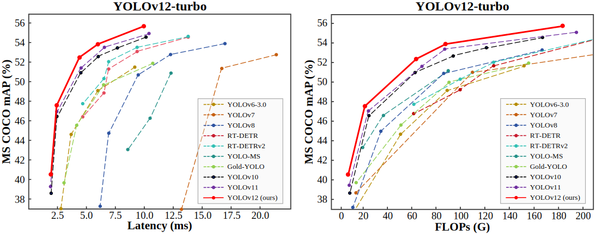

<div align="center">
<h1>YOLOv12</h1>
<h3>YOLOv12: Attention-Centric Real-Time Object Detectors</h3>

[Yunjie Tian](https://sunsmarterjie.github.io/)<sup>1</sup>, [Qixiang Ye](https://people.ucas.ac.cn/~qxye?language=en)<sup>2</sup>, [David Doermann](https://cse.buffalo.edu/~doermann/)<sup>1</sup>

<sup>1</sup>  University at Buffalo, SUNY, <sup>2</sup> University of Chinese Academy of Sciences.


<p align="center">
   <br>
  Comparison with popular methods in terms of latency-accuracy (left) and FLOPs-accuracy (right) trade-offs
</p>

</div>

[](https://arxiv.org/abs/2502.12524) [](https://huggingface.co/spaces/sunsmarterjieleaf/yolov12) <a href="https://colab.research.google.com/github/roboflow-ai/notebooks/blob/main/notebooks/train-yolov12-object-detection-model.ipynb"></a> [](https://www.kaggle.com/code/jxxn03x/yolov12-on-custom-data) [](https://blog.roboflow.com/use-yolov12-with-roboflow/#deploy-yolov12-models-with-roboflow) [](https://openbayes.com/console/public/tutorials/A4ac4xNrUCQ) 

## Updates

- 2025/03/18: Some guys are interested in the heatmap. See this [issue](https://github.com/sunsmarterjie/yolov12/issues/74).

- 2025/03/09: **YOLOv12-turbo** is released: a faster YOLOv12 version.

- 2025/02/24: Blogs: [ultralytics](https://docs.ultralytics.com/models/yolo12/), [LearnOpenCV](https://learnopencv.com/yolov12/). Thanks to them!

- 2025/02/22: [YOLOv12 TensorRT CPP Inference Repo + Google Colab Notebook](https://github.com/mohamedsamirx/YOLOv12-TensorRT-CPP).

- 2025/02/22: [Android deploy](https://github.com/mpj1234/ncnn-yolov12-android/tree/main) / [TensorRT-YOLO](https://github.com/laugh12321/TensorRT-YOLO) accelerates yolo12. Thanks to them!

- 2025/02/21: Try yolo12 for classification, oriented bounding boxes, pose estimation, and instance segmentation at [ultralytics](https://github.com/ultralytics/ultralytics/tree/main/ultralytics/cfg/models/12). Please pay attention to this [issue](https://github.com/sunsmarterjie/yolov12/issues/29). Thanks to them! 

- 2025/02/20: [Any computer or edge device?](https://github.com/roboflow/inference)  / [ONNX CPP Version](https://github.com/mohamedsamirx/YOLOv12-ONNX-CPP). Thanks to them! 
  
- 2025/02/20: Train a yolov12 model on a custom dataset: [Blog](https://blog.roboflow.com/train-yolov12-model/) and [Youtube](https://www.youtube.com/watch?v=fksJmIMIfXo). / [Step-by-step instruction](https://youtu.be/dO8k5rgXG0M). Thanks to them! 

- 2025/02/19: [arXiv version](https://arxiv.org/abs/2502.12524) is public. [Demo](https://huggingface.co/spaces/sunsmarterjieleaf/yolov12) is available (try [Demo2](https://huggingface.co/spaces/sunsmarterjieleaf/yolov12_demo2) [Demo3](https://huggingface.co/spaces/sunsmarterjieleaf/yolov12_demo3) if busy).


<details>
  <summary>
  <font size="+1">Abstract</font>
  </summary>
Enhancing the network architecture of the YOLO framework has been crucial for a long time but has focused on CNN-based improvements despite the proven superiority of attention mechanisms in modeling capabilities. This is because attention-based models cannot match the speed of CNN-based models. This paper proposes an attention-centric YOLO framework, namely YOLOv12, that matches the speed of previous CNN-based ones while harnessing the performance benefits of attention mechanisms.

YOLOv12 surpasses all popular real-time object detectors in accuracy with competitive speed. For example, YOLOv12-N achieves 40.6% mAP with an inference latency of 1.64 ms on a T4 GPU, outperforming advanced YOLOv10-N / YOLOv11-N by 2.1%/1.2% mAP with a comparable speed. This advantage extends to other model scales. YOLOv12 also surpasses end-to-end real-time detectors that improve DETR, such as RT-DETR / RT-DETRv2: YOLOv12-S beats RT-DETR-R18 / RT-DETRv2-R18 while running 42% faster, using only 36% of the computation and 45% of the parameters.
</details>


## Main Results

**Turbo (default version)**:
| Model                                                                                | size<br><sup>(pixels) | mAP<sup>val<br>50-95 | Speed<br><sup>T4 TensorRT10<br> | params<br><sup>(M) | FLOPs<br><sup>(G) |
| :----------------------------------------------------------------------------------- | :-------------------: | :-------------------:| :------------------------------:| :-----------------:| :---------------:|
| [YOLO12n](https://github.com/sunsmarterjie/yolov12/releases/download/turbo/yolov12n.pt) | 640                   | 40.4                 | 1.60                            | 2.5                | 6.0               |
| [YOLO12s](https://github.com/sunsmarterjie/yolov12/releases/download/turbo/yolov12s.pt) | 640                   | 47.6                 | 2.42                            | 9.1                | 19.4              |
| [YOLO12m](https://github.com/sunsmarterjie/yolov12/releases/download/turbo/yolov12m.pt) | 640                   | 52.5                 | 4.27                            | 19.6               | 59.8              |
| [YOLO12l](https://github.com/sunsmarterjie/yolov12/releases/download/turbo/yolov12l.pt) | 640                   | 53.8                 | 5.83                            | 26.5               | 82.4              |
| [YOLO12x](https://github.com/sunsmarterjie/yolov12/releases/download/turbo/yolov12x.pt) | 640                   | 55.4                 | 10.38                           | 59.3               | 184.6             |

[**v1.0**](https://github.com/sunsmarterjie/yolov12/tree/V1.0):
| Model                                                                                | size<br><sup>(pixels) | mAP<sup>val<br>50-95 | Speed<br><sup>T4 TensorRT10<br> | params<br><sup>(M) | FLOPs<br><sup>(G) |
| :----------------------------------------------------------------------------------- | :-------------------: | :-------------------:| :------------------------------:| :-----------------:| :---------------:|
| [YOLO12n](https://github.com/sunsmarterjie/yolov12/releases/download/v1.0/yolov12n.pt) | 640                   | 40.6                 | 1.64                            | 2.6                | 6.5               |
| [YOLO12s](https://github.com/sunsmarterjie/yolov12/releases/download/v1.0/yolov12s.pt) | 640                   | 48.0                 | 2.61                            | 9.3                | 21.4              |
| [YOLO12m](https://github.com/sunsmarterjie/yolov12/releases/download/v1.0/yolov12m.pt) | 640                   | 52.5                 | 4.86                            | 20.2               | 67.5              |
| [YOLO12l](https://github.com/sunsmarterjie/yolov12/releases/download/v1.0/yolov12l.pt) | 640                   | 53.7                 | 6.77                            | 26.4               | 88.9              |
| [YOLO12x](https://github.com/sunsmarterjie/yolov12/releases/download/v1.0/yolov12x.pt) | 640                   | 55.2                 | 11.79                           | 59.1               | 199.0             |

## Installation
```
wget https://github.com/Dao-AILab/flash-attention/releases/download/v2.7.3/flash_attn-2.7.3+cu11torch2.2cxx11abiFALSE-cp311-cp311-linux_x86_64.whl
conda create -n yolov12 python=3.11
conda activate yolov12
pip install -r requirements.txt
pip install -e .
```

## Validation
[`yolov12n`](https://github.com/sunsmarterjie/yolov12/releases/download/turbo/yolov12n.pt)
[`yolov12s`](https://github.com/sunsmarterjie/yolov12/releases/download/turbo/yolov12s.pt)
[`yolov12m`](https://github.com/sunsmarterjie/yolov12/releases/download/turbo/yolov12m.pt)
[`yolov12l`](https://github.com/sunsmarterjie/yolov12/releases/download/turbo/yolov12l.pt)
[`yolov12x`](https://github.com/sunsmarterjie/yolov12/releases/download/turbo/yolov12x.pt)

```python
from ultralytics import YOLO

model = YOLO('yolov12{n/s/m/l/x}.pt')
model.val(data='coco.yaml', save_json=True)
```

## Training 
```python
from ultralytics import YOLO

model = YOLO('yolov12n.yaml')

# Train the model
results = model.train(
  data='coco.yaml',
  epochs=600, 
  batch=256, 
  imgsz=640,
  scale=0.5,  # S:0.9; M:0.9; L:0.9; X:0.9
  mosaic=1.0,
  mixup=0.0,  # S:0.05; M:0.15; L:0.15; X:0.2
  copy_paste=0.1,  # S:0.15; M:0.4; L:0.5; X:0.6
  device="0,1,2,3",
)

# Evaluate model performance on the validation set
metrics = model.val()

# Perform object detection on an image
results = model("path/to/image.jpg")
results[0].show()

```

## Prediction
```python
from ultralytics import YOLO

model = YOLO('yolov12{n/s/m/l/x}.pt')
model.predict()
```

## Export
```python
from ultralytics import YOLO

model = YOLO('yolov12{n/s/m/l/x}.pt')
model.export(format="engine", half=True)  # or format="onnx"
```


## Demo

```
python app.py
# Please visit http://127.0.0.1:7860
```


## Acknowledgement

The code is based on [ultralytics](https://github.com/ultralytics/ultralytics). Thanks for their excellent work!

## Citation

```BibTeX
@article{tian2025yolov12,
  title={YOLOv12: Attention-Centric Real-Time Object Detectors},
  author={Tian, Yunjie and Ye, Qixiang and Doermann, David},
  journal={arXiv preprint arXiv:2502.12524},
  year={2025}
}
```

# YOLOv12-Face

YOLOv12-Face是在YOLOv12基础上修改的人脸检测和5点关键点检测模型。该模型可以同时检测人脸位置和5个面部关键点（左眼、右眼、鼻尖、左嘴角、右嘴角）。

## 特点

- 基于YOLOv12的注意力机制驱动的实时目标检测框架
- 支持人脸边界框检测和5点人脸关键点定位
- 保持YOLOv12高效的推理速度和精度
- 支持不同规模的模型变体(nano/small/medium/large/xlarge)

## 文件结构

- `ultralytics/cfg/models/v12/yolov12-face.yaml`: 模型配置文件
- `ultralytics/cfg/datasets/face-landmarks.yaml`: 数据集配置文件

## 安装

确保已安装最新版本的Ultralytics库:

```bash
pip install ultralytics
```

## 数据集准备

准备包含人脸和关键点标注的数据集，组织结构如下：

```
face-landmarks/
├── train/
│   ├── images/
│   │   ├── img1.jpg
│   │   ├── img2.jpg
│   │   └── ...
│   └── labels/
│       ├── img1.txt
│       ├── img2.txt
│       └── ...
├── val/
│   ├── images/
│   │   └── ...
│   └── labels/
│       └── ...
└── test/
    ├── images/
    │   └── ...
    └── labels/
        └── ...
```

标签文件格式（每行一个目标）：
```
0 x_center y_center width height x1 y1 v1 x2 y2 v2 x3 y3 v3 x4 y4 v4 x5 y5 v5
```

其中：
- `0`: 类别ID (人脸)
- `x_center y_center width height`: 归一化的边界框坐标和尺寸
- `x1 y1 v1 ... x5 y5 v5`: 5个关键点的归一化坐标和可见性
  - 左眼: (x1, y1, v1)
  - 右眼: (x2, y2, v2)
  - 鼻尖: (x3, y3, v3)
  - 左嘴角: (x4, y4, v4)
  - 右嘴角: (x5, y5, v5)
  - 可见性v取值：0=不可见，1=可见但模糊，2=完全可见

## 训练

### 使用命令行

```bash
# 从预训练的YOLOv12模型训练
yolo train model=yolov12-face.yaml data=face-landmarks.yaml pretrained=yolov12n.pt epochs=100 imgsz=640

# 从头开始训练
yolo train model=yolov12-face.yaml data=face-landmarks.yaml epochs=300 imgsz=640
```

### 使用Python代码

```python
from ultralytics import YOLO

# 从预训练的YOLOv12模型加载
model = YOLO('yolov12n.pt')
# 训练模型
results = model.train(
    model='yolov12-face.yaml',  # 模型配置
    data='face-landmarks.yaml',  # 数据集配置
    epochs=100,                  # 训练轮数
    imgsz=640,                   # 图像大小
    batch=16,                    # 批次大小
    name='yolov12-face'          # 结果保存名称
)
```

## 评估

```bash
# 评估训练好的模型
yolo val model=runs/train/yolov12-face/weights/best.pt data=face-landmarks.yaml
```

## 推理

```python
from ultralytics import YOLO

# 加载训练好的模型
model = YOLO('runs/train/yolov12-face/weights/best.pt')

# 单张图像推理
results = model('path/to/face/image.jpg')

# 显示结果
for r in results:
    boxes = r.boxes  # 边界框
    keypoints = r.keypoints  # 关键点
    
    # 打印结果
    print(f"检测到 {len(boxes)} 个人脸")
    for i, box in enumerate(boxes):
        print(f"人脸 {i+1}: {box.xyxy.tolist()[0]}, 置信度: {box.conf.item():.2f}")
        kpts = keypoints[i].data.tolist()[0]
        print(f"  左眼: ({kpts[0][0]:.1f}, {kpts[0][1]:.1f})")
        print(f"  右眼: ({kpts[1][0]:.1f}, {kpts[1][1]:.1f})")
        print(f"  鼻尖: ({kpts[2][0]:.1f}, {kpts[2][1]:.1f})")
        print(f"  左嘴角: ({kpts[3][0]:.1f}, {kpts[3][1]:.1f})")
        print(f"  右嘴角: ({kpts[4][0]:.1f}, {kpts[4][1]:.1f})")
    
# 保存结果
model('path/to/image.jpg', save=True)  # 保存标注后的图像

# 视频/摄像头推理
model('path/to/video.mp4', show=True)  # 显示结果
model(0)  # 使用摄像头
```

## 导出模型

```bash
# 导出为ONNX格式
yolo export model=runs/train/yolov12-face/weights/best.pt format=onnx
```

## 自定义模型规模

YOLOv12-Face提供5种规模的模型，可以根据应用需求选择:

- `yolov12n-face.pt`: 最小模型，适合移动设备
- `yolov12s-face.pt`: 小型模型，平衡速度和精度
- `yolov12m-face.pt`: 中型模型，提供更好的精度
- `yolov12l-face.pt`: 大型模型，高精度
- `yolov12x-face.pt`: 超大模型，最高精度

## 参考
- YOLOv12: https://github.com/ultralytics/ultralytics
- 人脸关键点检测: https://github.com/ultralytics/ultralytics/blob/main/ultralytics/models/yolo/pose/val.py

